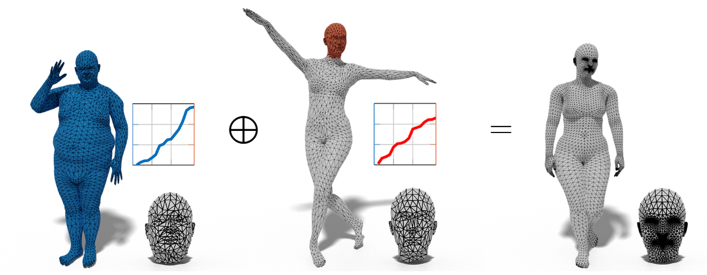

# Localized-Shape-Modelling-with-Global-Coherence
Code of the paper *"Localized Shape Modelling with Global Coherence: An Inverse Spectral Approach"*

## Setup

Load the coda environment: 
    `conda env create -f environment.yml`

Download the folders containing the datasets as .mat files from this link:
> https://1drv.ms/u/s!AkyShb75UDGyarSEgmNmiZCQ5KU?e=ReJMnI

## Training

You can train the model on different datasets.

To train the model on SURREAL, run: 
    `python TrainingSURREAL.py`
    
To train the model on CUBE, run:    
    `python TrainingCUBE.py`

## Testing

Once the training is completed, you can test the model with: 
    `python intrinsic_error.py`
